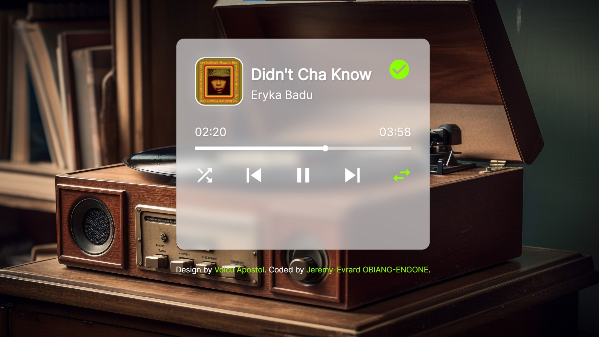

# Integration of a dribble design

This is an integration to the [Glass Audio Player design on dribble](https://dribbble.com/shots/23528020-Glass-Audio-Player).

## Table of contents

- [Overview](#overview)
  - [The challenge](#the-challenge)
  - [Screenshot](#screenshot)
  - [Links](#links)
- [My process](#my-process)
  - [Built with](#built-with)
- [Author](#author)

## Overview

### The challenge

Users should be able to:

- Code the behavior of an input range with MouseMove, MouseUp, MouseDown, TouchStart, TouchMove and TouchEnd

### Screenshot

### Links

- Solution URL: [Here is my repos](https://github.com/Jerems412Dev/Music_player)
- Live Site URL: [Here is the site url](<https://your-live-site-url.com](https://social-links-profile-main-jerems.vercel.app/)>)

## My process

### Built with

- Semantic HTML5 markup
- CSS custom properties
- Javascript with MouseMove, MouseUp, MouseDown, TouchStart, TouchMove and TouchEnd.

## Author

- Website - [@Jerems](#)
- LinkedIn - [@jerems](https://www.linkedin.com/in/j%C3%A9r%C3%A9my-evrard-obiang-engone-257436247/)
- Twitter - [@jerems](<https://www.twitter.com/yourusername](https://x.com/jeremsOb)>)
